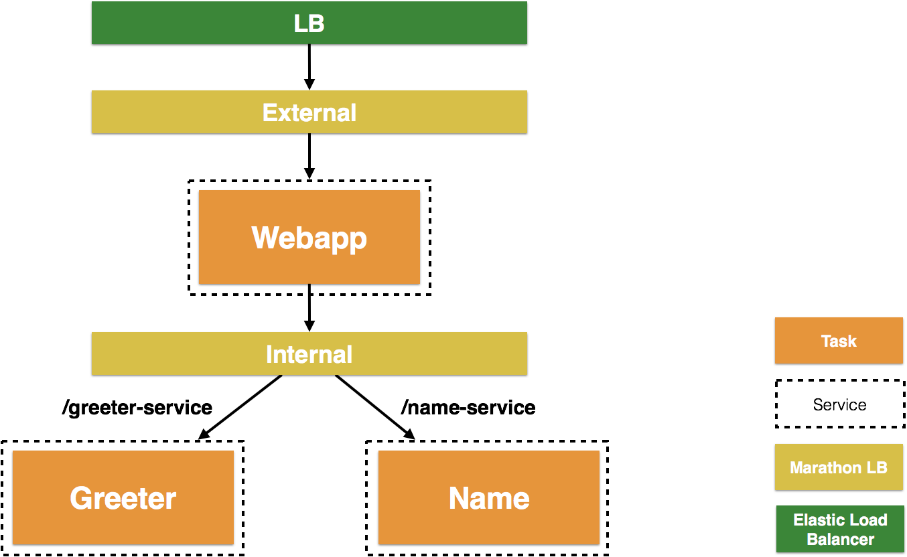

:toc:

= Service Discovery for Microservices with Mesosphere DC/OS

This document is referred from link:readme.adoc[Service Discovery in Container Orchestration Frameworks on AWS]. It explains how to setup a DC/OS cluster and configure service discovery. Refer link:readme.adoc[back] for more details.

[.thumb]


== Create cluster

. Install DC/OS on AWS using https://downloads.dcos.io/dcos/stable/1.9.1/aws.html?_ga=2.16283190.123750055.1502715145-1655111557.1497965615[Cloud Formation] templates.
. Download and configure https://docs.mesosphere.com/1.9/cli/configure/[DC/OS CLI].
. Setup a DC/OS cluster and configure services as explained in link:dcos.adoc[Service Discovery for Microservices with DC/OS].

== Deploy application

Install the following components:

```
dcos package install marathon-lb
dcos package install marathon-lb --options=config/dcos-marathon-lb-internal.json
dcos marathon app add config/dcos-greeter.json
dcos marathon app add config/dcos-name.json
dcos marathon app add config/dcos-webapp.json
```

== Delete application and cluster

. Delete the CloudFormation template

This will delete the deployed application as well.
