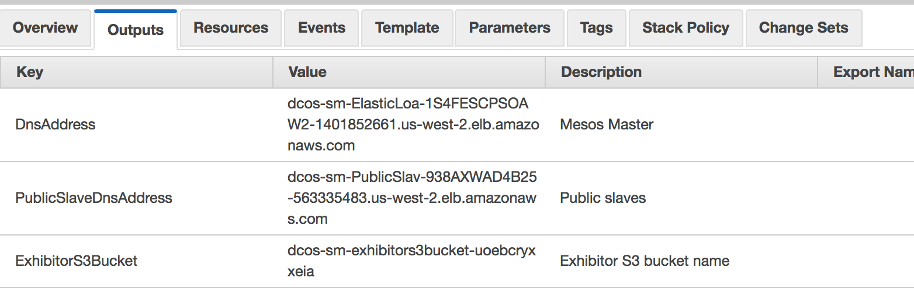

:toc:

= Service Discovery for Microservices with Mesosphere DC/OS

This document is referred from link:readme.adoc[Service Discovery in Container Orchestration Frameworks on AWS]. It explains how to setup a DC/OS cluster and configure service discovery. Refer link:readme.adoc[back] for more details.

[.thumb]
image::images/dcos-services.png[]

== Create cluster

. Install DC/OS on AWS using https://downloads.dcos.io/dcos/stable/1.9.1/aws.html?_ga=2.16283190.123750055.1502715145-1655111557.1497965615[Cloud Formation] templates.
. Download and configure https://docs.mesosphere.com/1.9/cli/configure/[DC/OS CLI].
. Setup a DC/OS cluster and configure services as explained in link:dcos.adoc[Service Discovery for Microservices with DC/OS].

== Deploy application

. Deploy the external load balancer:
+
```
$ dcos package install marathon-lb --yes
We recommend at least 2 CPUs and 1GiB of RAM for each Marathon-LB instance.

*NOTE*: For additional ``Enterprise Edition`` DC/OS instructions, see https://docs.mesosphere.com/administration/id-and-access-mgt/service-auth/mlb-auth/
Installing Marathon app for package [marathon-lb] version [1.10.0]
Marathon-lb DC/OS Service has been successfully installed!
See https://github.com/mesosphere/marathon-lb for documentation.
```
+
. Deploy the internal load balancer
+
```
$ dcos package install marathon-lb --options=config/dcos-marathon-lb-internal.json --yes

We recommend at least 2 CPUs and 1GiB of RAM for each Marathon-LB instance.

*NOTE*: For additional ```Enterprise Edition``` DC/OS instructions, see https://docs.mesosphere.com/administration/id-and-access-mgt/service-auth/mlb-auth/
Installing Marathon app for package [marathon-lb] version [1.10.0]
Marathon-lb DC/OS Service has been successfully installed!
See https://github.com/mesosphere/marathon-lb for documentation.
```
+
. Deploy the Greater Application
+
```
$ dcos marathon app add config/dcos-greeter.json
Created deployment 904a5be4-6134-4d79-9b22-7c9067ef27d2
```
+
. Deploy the Name Application
+
```
$ dcos marathon app add config/dcos-name.json
Created deployment 1ba6c53d-4044-4abd-b3d0-e0c50b6e7ac8
```
+
. Get Public DNS Address `PublicSlaveDnsAddress`
+
[.thumb]

+
. Modify `HAPROXY_0_VHOST` in `config/dcos-webapp.json`
+
```
  "labels":{  
    "HAPROXY_0_VHOST":"{PublicSlaveDnsAddress}",
    ...
  }
```
+
. Deploy the WebApp
+
```
$ dcos marathon app add config/dcos-webapp.json
Created deployment b960c005-dcf6-4cc4-a6ec-2cfb81f9c5a3
```

== Delete application and cluster

. Delete the CloudFormation template

This will delete the deployed application as well.
