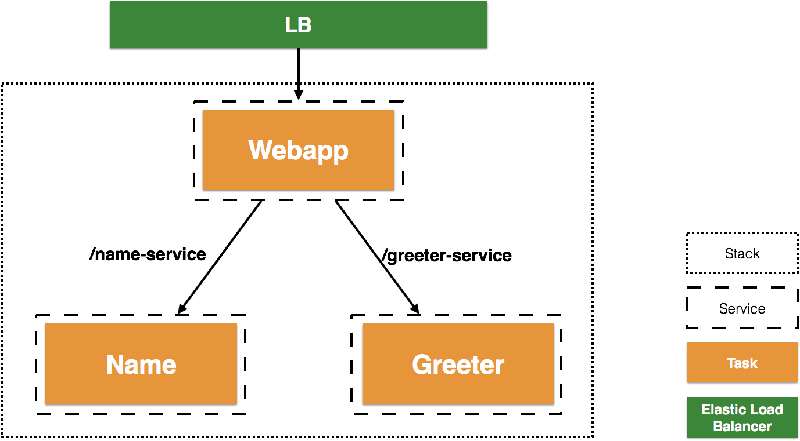
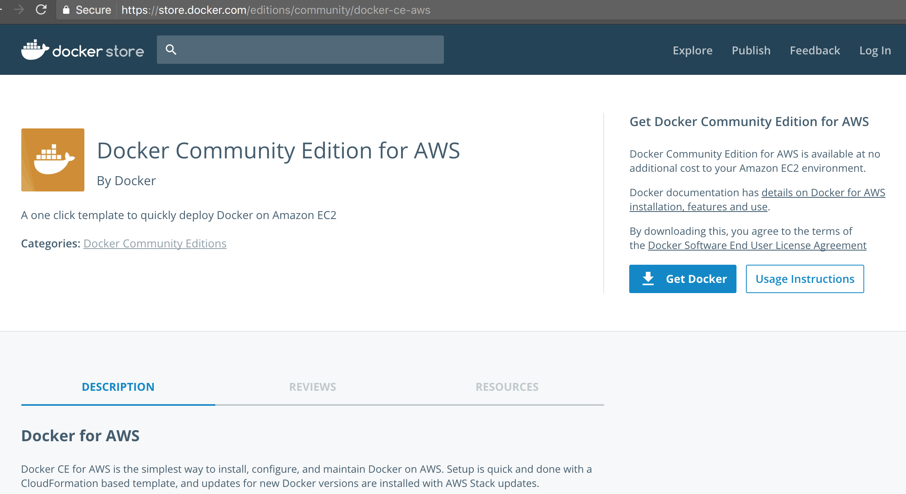
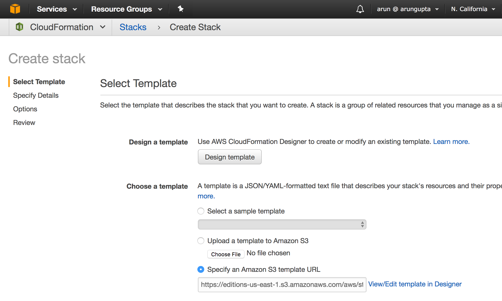
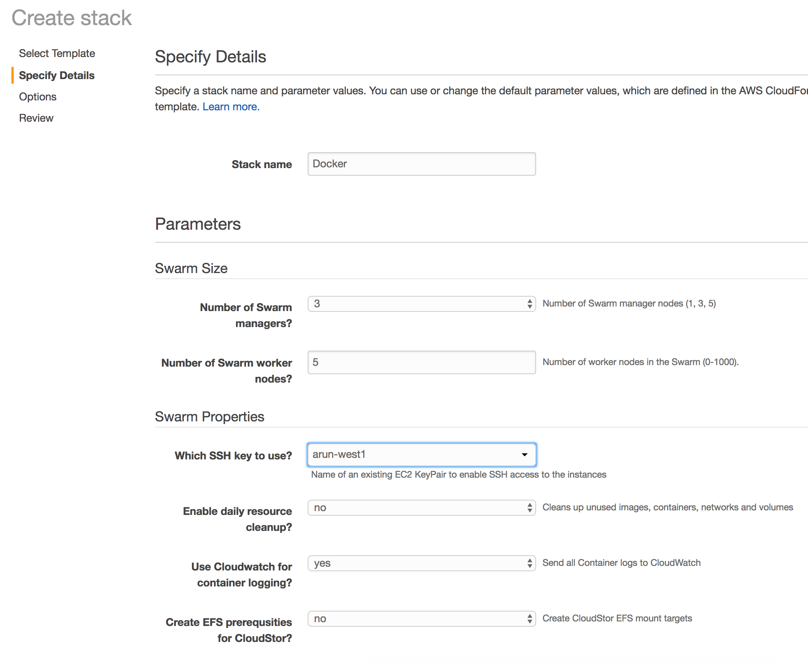
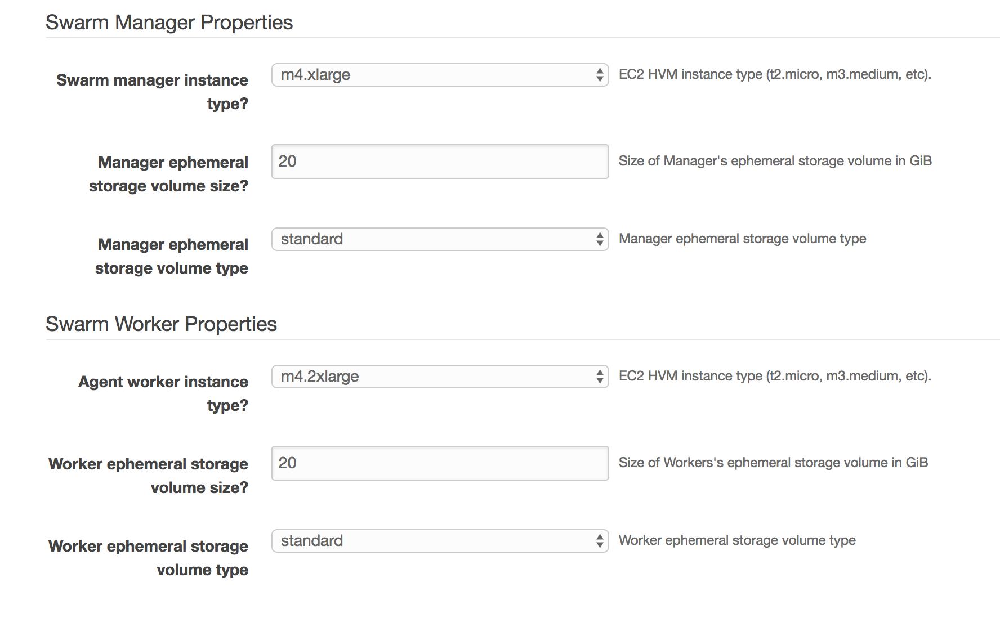
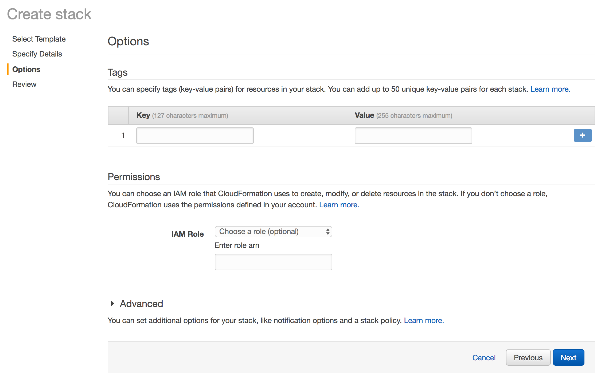
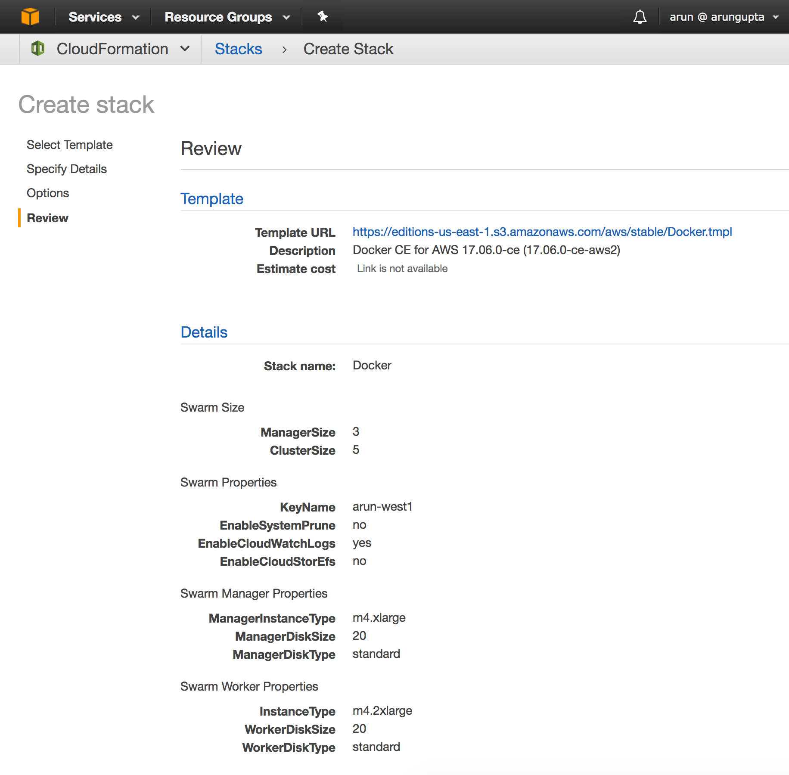
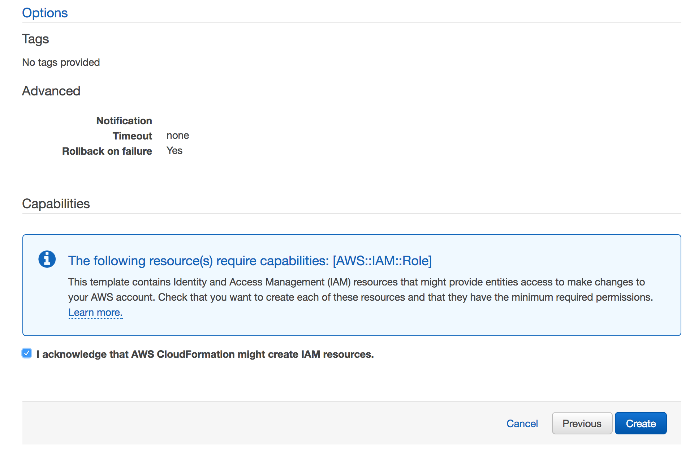
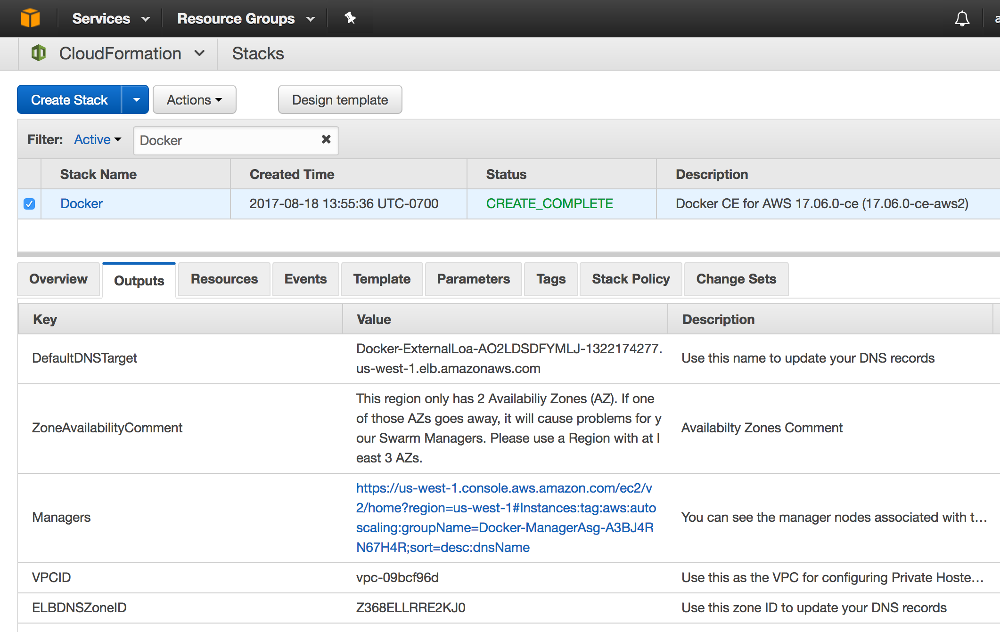
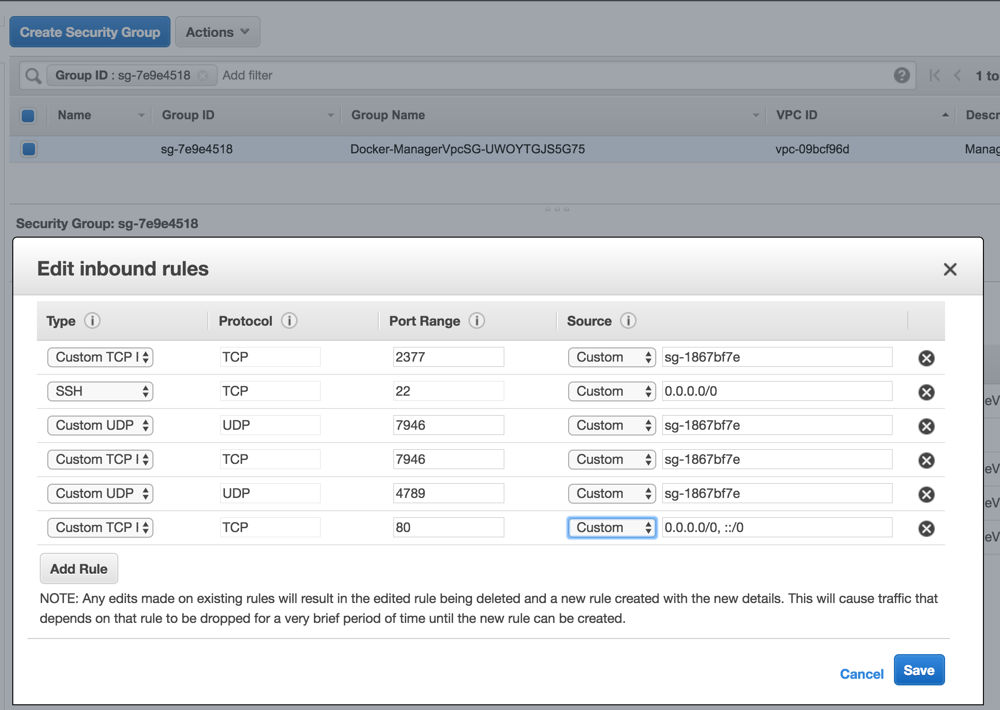

:toc:

= Service Discovery for Microservices with Docker on AWS

This document is referred from link:readme.adoc[Service Discovery in Container Orchestration Frameworks on AWS]. It explains how to setup a Docker cluster and configure service discovery. Refer link:readme.adoc[back] for more details.

[.thumb]


== Create cluster on AWS

Start at https://store.docker.com/editions/community/docker-ce-aws

[.thumb]


[.thumb]


[.thumb]


[.thumb]


[.thumb]


[.thumb]


[.thumb]


[.thumb]



== Connect to Docker Manager

Explained at https://docs.docker.com/docker-for-aws/deploy/

=== List of nodes

```
docker -H localhost:2374 node ls
ID                            HOSTNAME                                      STATUS              AVAILABILITY        MANAGER STATUS
yzosr5w985ltah1i8j9cdvbc1     ip-172-31-6-145.us-west-1.compute.internal    Ready               Active              
mf223jh0d25l1f3uxex4wl8yc *   ip-172-31-8-153.us-west-1.compute.internal    Ready               Active              Reachable
lp947wlywem3b0oxflj43pybn     ip-172-31-9-104.us-west-1.compute.internal    Ready               Active              Leader
w5at9m1j8t07f1inggbk7r7uu     ip-172-31-11-202.us-west-1.compute.internal   Ready               Active              
r73k2ut14eydeh9qrjf7tt8u7     ip-172-31-14-178.us-west-1.compute.internal   Ready               Active              
cmnawu0qxhdop70ymfx6weide     ip-172-31-19-143.us-west-1.compute.internal   Ready               Active              
2kuwd5gjjuhwk5pt451buwtpt     ip-172-31-24-194.us-west-1.compute.internal   Ready               Active              
yjleppi9xj1cazasozlp6jv0f     ip-172-31-27-252.us-west-1.compute.internal   Ready               Active              Reachable
```

=== Details about the cluster

```
docker -H localhost:2374 info
Containers: 5
 Running: 4
 Paused: 0
 Stopped: 1
Images: 5
Server Version: 17.06.0-ce
Storage Driver: overlay2
 Backing Filesystem: extfs
 Supports d_type: true
 Native Overlay Diff: true
Logging Driver: awslogs
Cgroup Driver: cgroupfs
Plugins: 
 Volume: local
 Network: bridge host ipvlan macvlan null overlay
 Log: awslogs fluentd gcplogs gelf journald json-file logentries splunk syslog
Swarm: active
 NodeID: mf223jh0d25l1f3uxex4wl8yc
 Is Manager: true
 ClusterID: ltmdxr5hat11ywuz4ft0inmi0
 Managers: 3
 Nodes: 8
 Orchestration:
  Task History Retention Limit: 5
 Raft:
  Snapshot Interval: 10000
  Number of Old Snapshots to Retain: 0
  Heartbeat Tick: 1
  Election Tick: 3
 Dispatcher:
  Heartbeat Period: 5 seconds
 CA Configuration:
  Expiry Duration: 3 months
  Force Rotate: 0
 Root Rotation In Progress: false
 Node Address: 172.31.8.153
 Manager Addresses:
  172.31.27.252:2377
  172.31.8.153:2377
  172.31.9.104:2377
Runtimes: runc
Default Runtime: runc
Init Binary: docker-init
containerd version: cfb82a876ecc11b5ca0977d1733adbe58599088a
runc version: 2d41c047c83e09a6d61d464906feb2a2f3c52aa4
init version: 949e6fa
Security Options:
 seccomp
  Profile: default
Kernel Version: 4.9.36-moby
Operating System: Alpine Linux v3.5
OSType: linux
Architecture: x86_64
CPUs: 4
Total Memory: 15.65GiB
Name: ip-172-31-8-153.us-west-1.compute.internal
ID: BQ5B:J4FX:NUL6:GVAD:DA6Y:MA4H:I442:NHDS:IFBT:HI2Y:HBJU:Y5VH
Docker Root Dir: /var/lib/docker
Debug Mode (client): false
Debug Mode (server): true
 File Descriptors: 79
 Goroutines: 166
 System Time: 2017-08-18T21:38:33.839729532Z
 EventsListeners: 0
Registry: https://index.docker.io/v1/
Labels:
 os=linux
 region=us-west-1
 availability_zone=us-west-1b
 instance_type=m4.xlarge
 node_type=manager
Experimental: true
Insecure Registries:
 127.0.0.0/8
Live Restore Enabled: false
```

== Deploy application

. Deploy the application:
+
```
docker -H localhost:2374 stack up --compose-file=config/docker-compose.yml webapp
Ignoring unsupported options: build

Creating network webapp_default
Creating service webapp_name-service
Creating service webapp_webapp-service
Creating service webapp_greeter-service
```
+
. List the services:
+
```
docker -H localhost:2374 service ls
ID                  NAME                     MODE                REPLICAS            IMAGE                              PORTS
149hms4paf7b        webapp_webapp-service    replicated          1/1                 arungupta/webapp-service:latest    *:8080->8080/tcp
c6j39rmxi2ix        webapp_name-service      replicated          1/1                 arungupta/name-service:latest      
ttwfk3jgew42        webapp_greeter-service   replicated          1/1                 arungupta/greeter-service:latest  
```
+
. Create an inbound rule for the Master to allow connections over port 80:
+
[.thumb]


== Delete application and cluster

```
docker -H localhost:2374 stack rm webapp
```

Make sure to delete the CloudFormation template.

