:toc:

= Service Discovery for Microservices with Amazon ECS

This document is referred from link:readme.adoc[Service Discovery in Container Orchestration Frameworks on AWS]. It explains how to setup a Amazon EC2 Container Service cluster and configure service discovery. Refer link:readme.adoc[back] for more details.

image::images/ecs-services.png[]

== Create Cluster

[.thumb]
image::images/ecs-service-discovery-1.png[]

[.thumb]
image::images/ecs-service-discovery-2.png[]

== Create Target Groups

[.thumb]
image::images/ecs-service-discovery-3.png[]

[.thumb]
image::images/ecs-service-discovery-4.png[]

[.thumb]
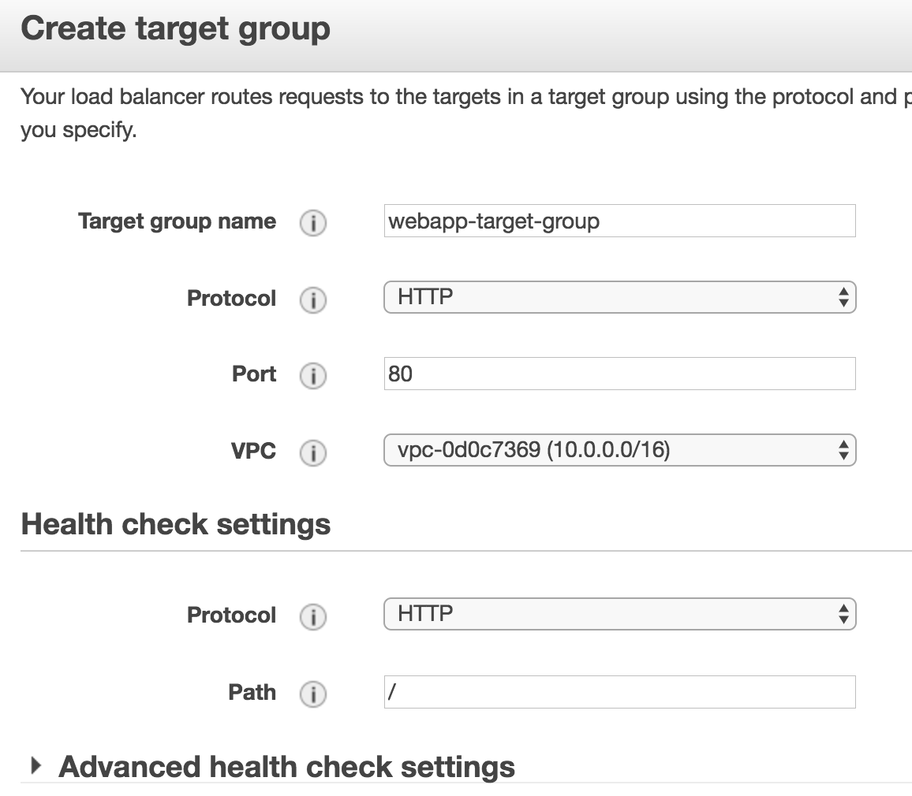

== Create Application Load Balancer

=== Internal ALB

[.thumb]
image::images/ecs-service-discovery-6.png[]

[.thumb]
image::images/ecs-service-discovery-7.png[]

[.thumb]
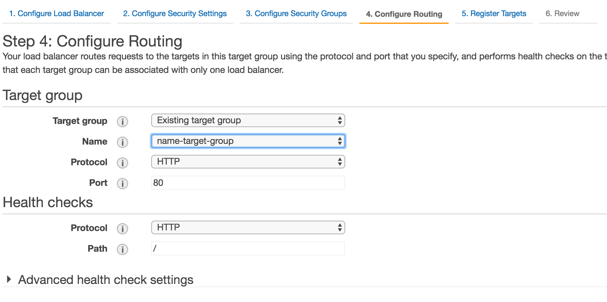

[.thumb]
image::images/ecs-service-discovery-9.png[]

==== Create rules

[.thumb]
image::images/ecs-service-discovery-10.png[]

[.thumb]
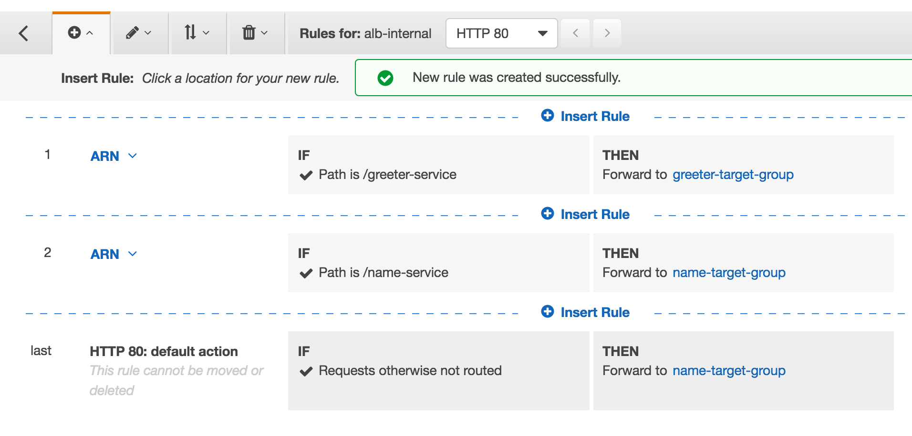

=== External ALB

[.thumb]
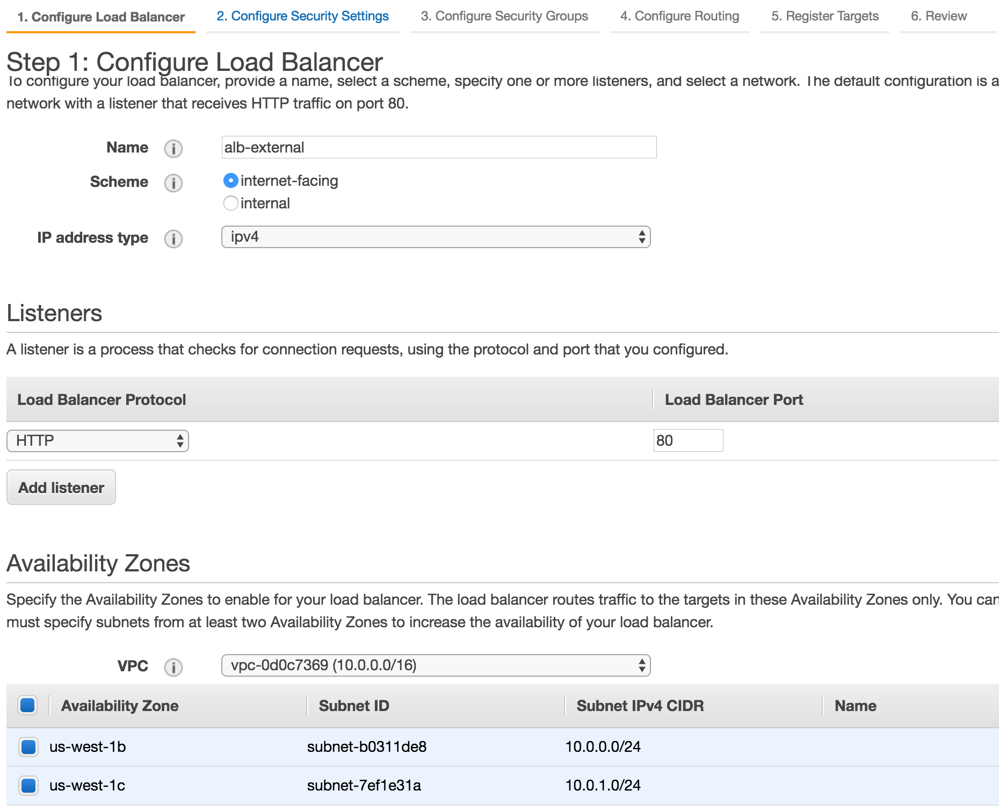

[.thumb]
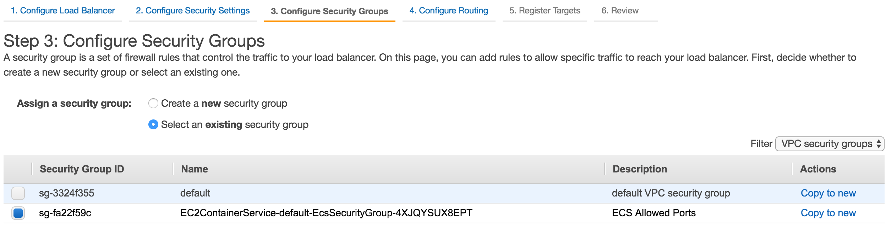

[.thumb]
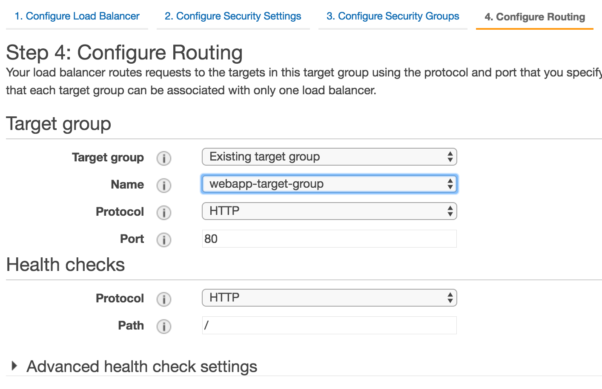

[.thumb]
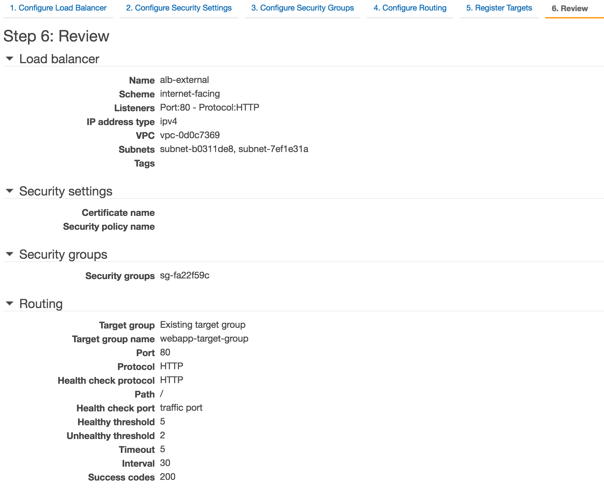

== Edit Security Group

[.thumb]
image::images/ecs-service-discovery-16.png[]

== Add Task Definitions

=== Name Task

[.thumb]
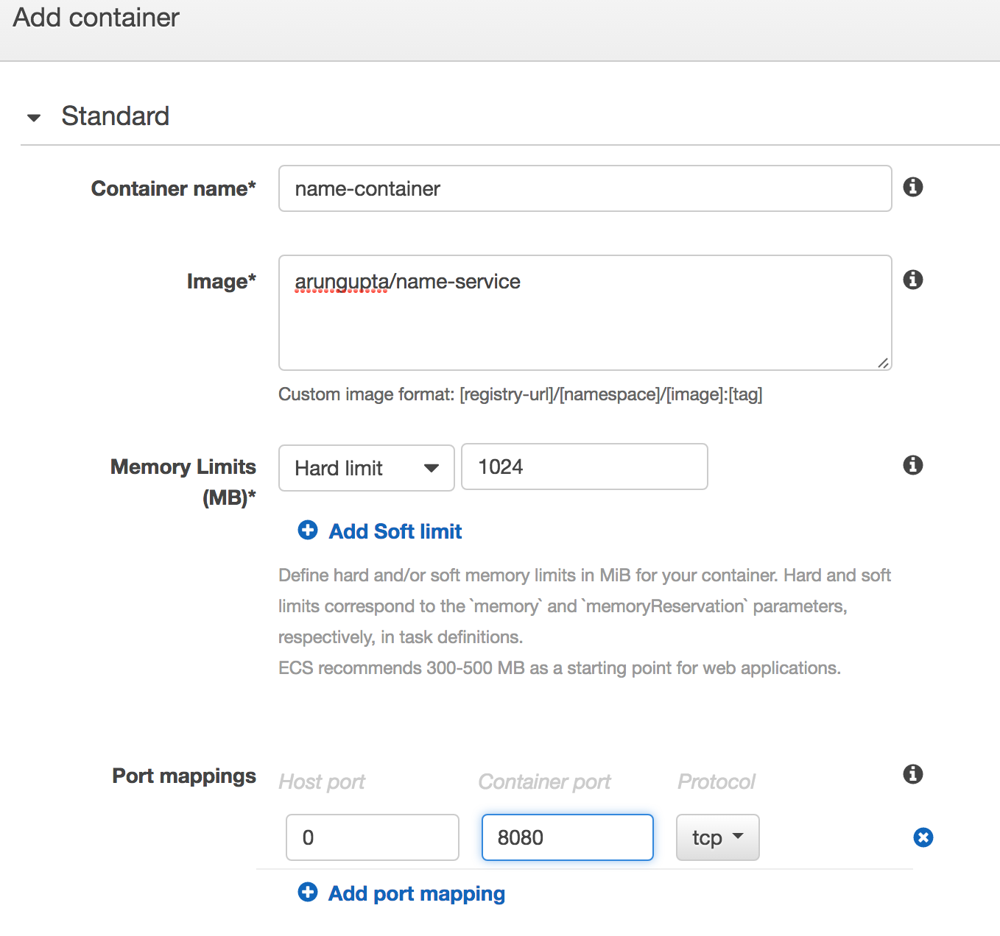

[.thumb]
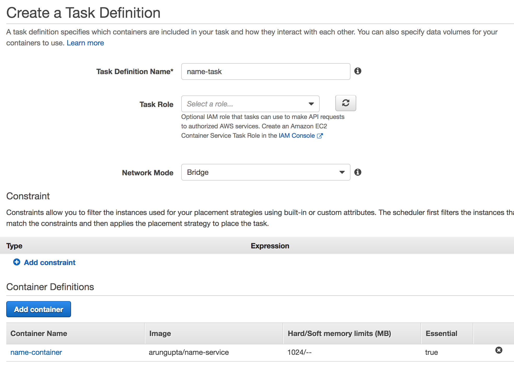

=== Greeter Task

[.thumb]
image::images/ecs-service-discovery-19.png[]

[.thumb]
image::images/ecs-service-discovery-20.png[]

=== Webapp Task

[.thumb]
image::images/ecs-service-discovery-21.png[]

[.thumb]
image::images/ecs-service-discovery-22.png[]

[.thumb]
image::images/ecs-service-discovery-23.png[]

== Create Service

=== Name Service

[.thumb]
image::images/ecs-service-discovery-24.png[]

[.thumb]
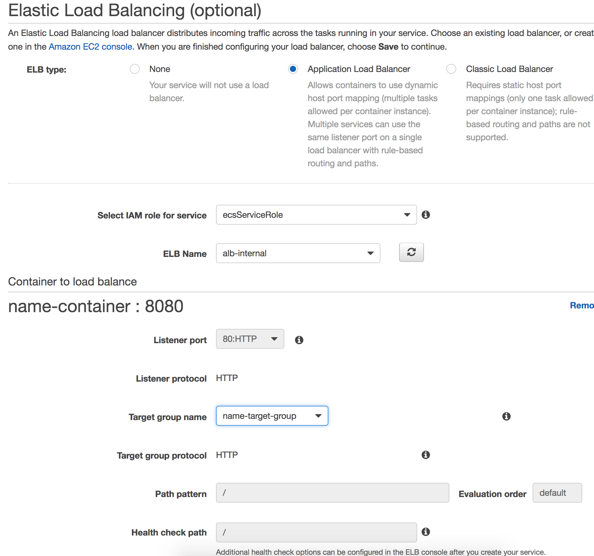

==== Check health

[.thumb]
image::images/ecs-service-discovery-26.png[]

=== Greeter Service

[.thumb]
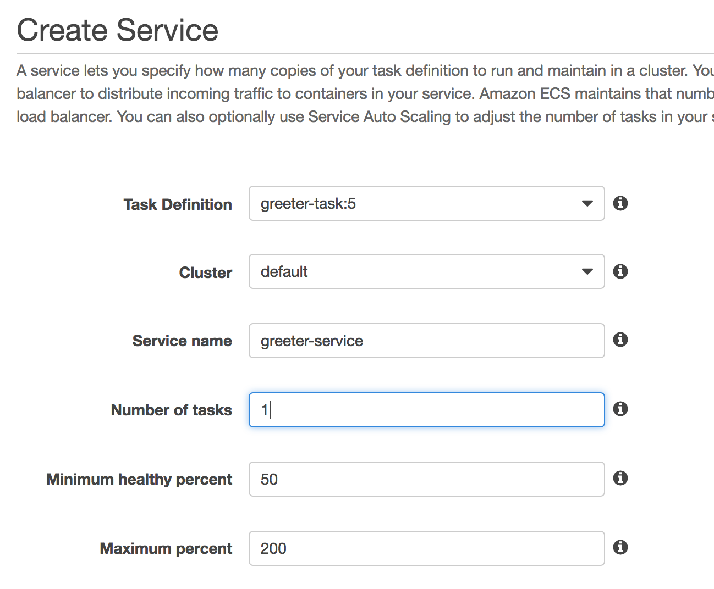

[.thumb]
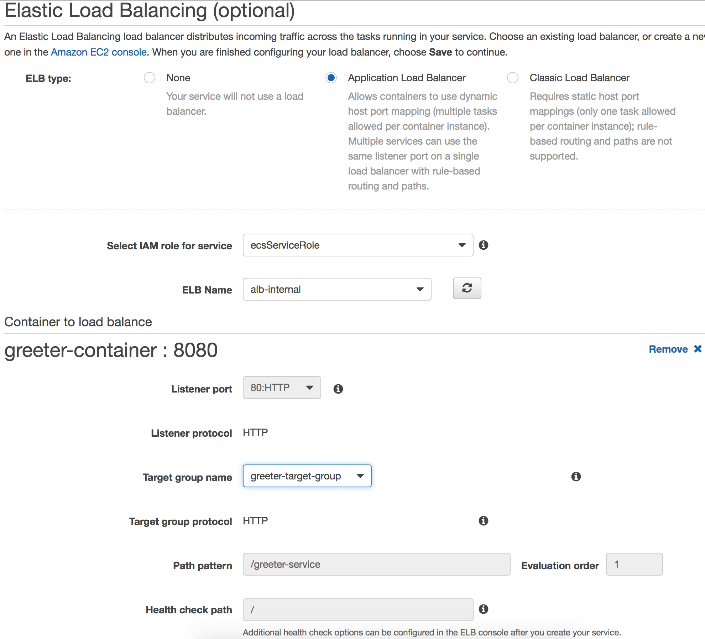

==== Check health

[.thumb]
image::images/ecs-service-discovery-29.png[]

=== Webapp Service

[.thumb]
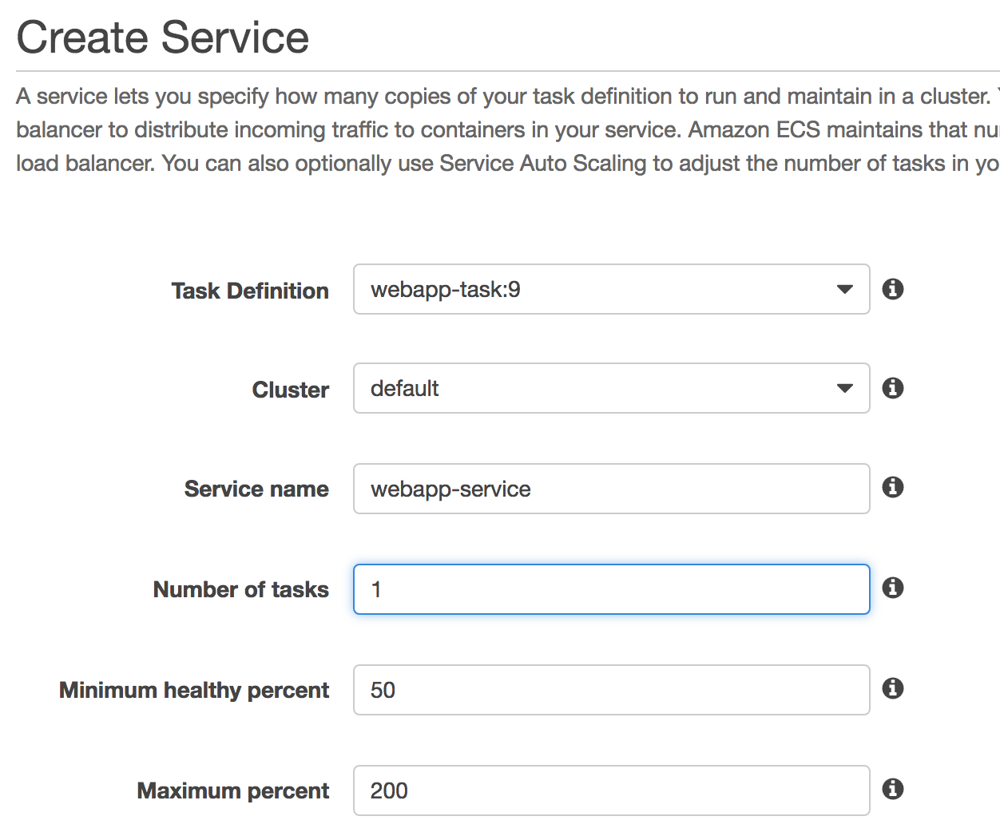

[.thumb]
image::images/ecs-service-discovery-31.png[]

==== Check health

[.thumb]
image::images/ecs-service-discovery-32.png[]

