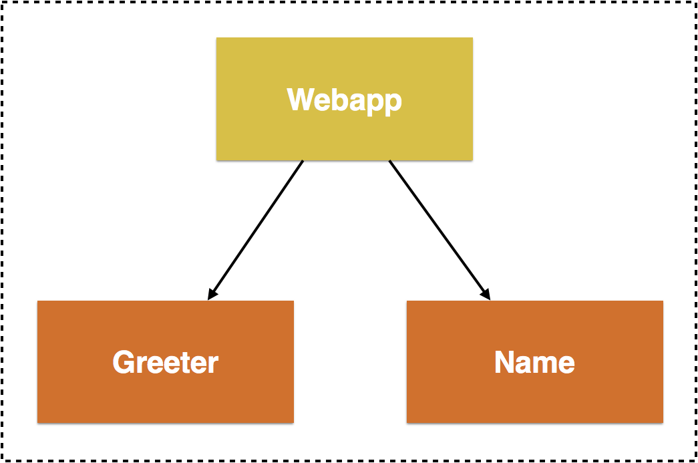
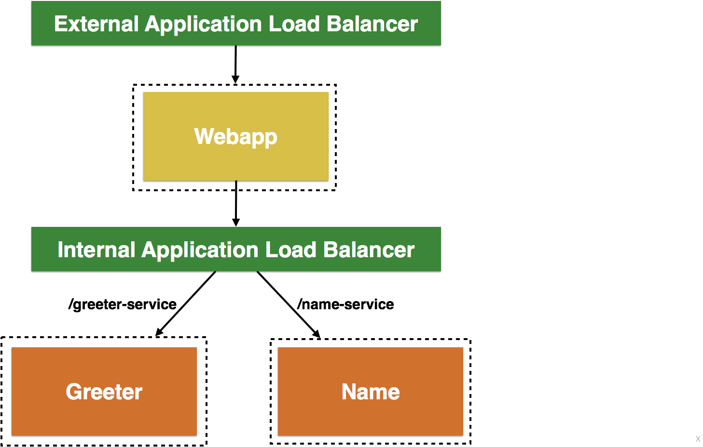

:toc:

= Service Discovery in Container Orchestration Frameworks on AWS

This repo has a simple example that shows service discovery for different container orchestration frameworks.

The sample application uses three services:



. `webapp`: Web application microservice uses `greeter` and `name` microservice to generate a greeting for a person.
. `greeter`: A microservice returns a greeting based upon `greet` name/value keypair in the URL.
. `name`: A microservice that returns person's name based upon `id` name/value keypair in the URL.

All services are built as Node.js application. `webapp` service need to be configured using the following parameters:

. `NAME_SERVICE_HOST`
. `NAME_SERVICE_PORT`
. `NAME_SERVICE_PATH`
. `GREETER_SERVICE_HOST`
. `GREETER_SERVICE_PORT`
. `GREETER_SERVICE_PATH`

== Build services

Build the Docker images for different services:

```
docker-compose build
```

== Run services

=== Using Docker

The parameter values are defined in `config/docker-compose.yml`.

Start the services:

```
docker swarm init
docker stack up --compose-file=config/docker-compose.yml webapp
```

=== Using ECS

Setup an ECS cluster and configure services as explained in link:ecs.adoc[Service Discovery for Microservices with Amazon ECS].



=== Using Kubernetes

Start a single node Kubernetes cluster using minikube. Create resources:

```
kubectl create -f config/k8s-config.yml
kubectl expose service webapp-service --port=8080 --target-port=8080 --name=web
kubectl proxy
```

Access endpoint: `curl http://localhost:8001/api/v1/proxy/namespaces/default/services/web/`

== Access service using web application

Access the following URLs using curl or in browser:

```
http://<host>:<port>
http://<host>:<port>0?greet=ho
http://<host>:<port>?id=1
http://<host>:<port>?greet=ho&id=1
```

[options="header"]
|=======
|Framework |<host> |<port>
| Docker | `localhost` | `8080`
| ECS | External ALB Address | `80`
| Kubernetes | Proxy | Proxy
|=======

== Delete services

=== Using Docker

```
docker stack rm webapp
docker swarm leave -f
```

=== Using ECS

. Scale down all services
. Delete services
. Deregister tasks
. Delete ALB
. Delete Target Groups
. Delete cluster

